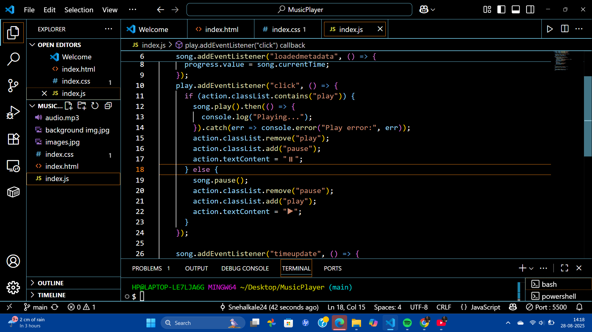
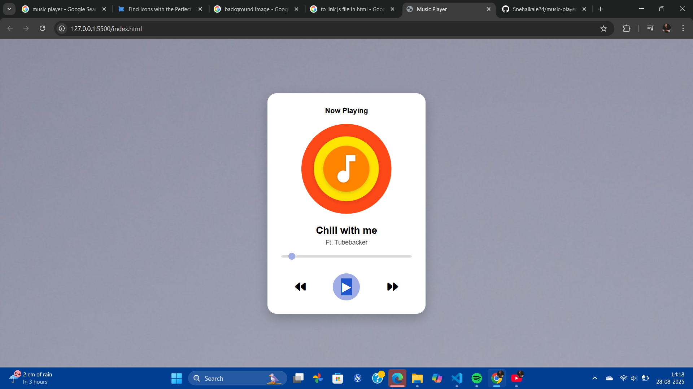

# Music player
A simple and interactive Music Player built using HTML, CSS, and JavaScript.
It allows users to play, pause, skip, and control music with a modern UI design.
---
### 🚀 Features
🎶 Play / Pause music

⏭️ Next / Previous track navigation

❤️ Like (favorite) button

📊 Progress bar with seeking support

🔊 Volume control

---
### screenshots

-

---
### 🛠️ Tech Stack

HTML5 → Structure

CSS3 → Styling & Animations

JavaScript (ES6) → Functionality

